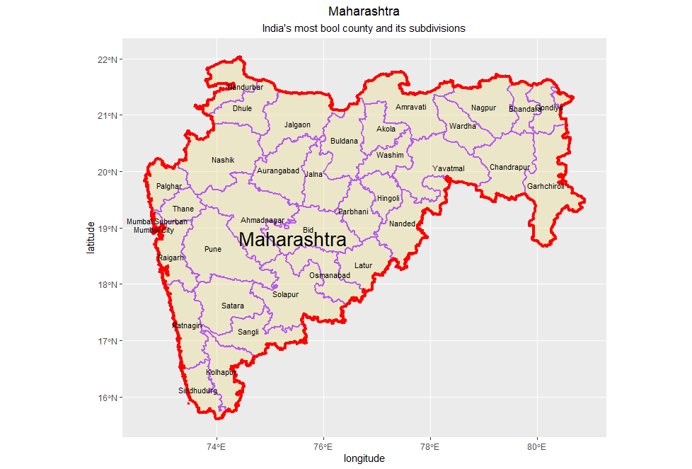
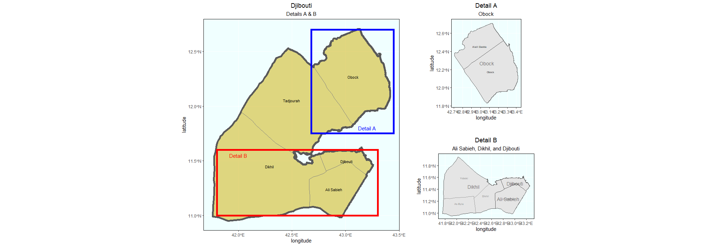

# Project 1

In this project, I made a plot of India using ggplot with some information on cities and counties.

Here's one of the stretch goals, I didn't realize they weren't required but oh well:

And here's when I realized picking India was a foolish idea and so I switched to Djibouti to do the last part:

