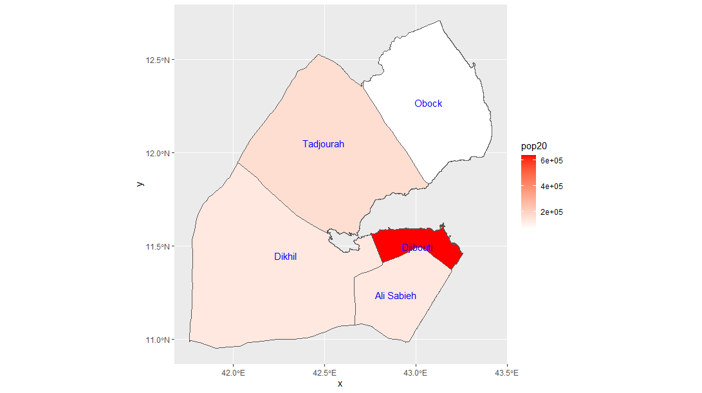
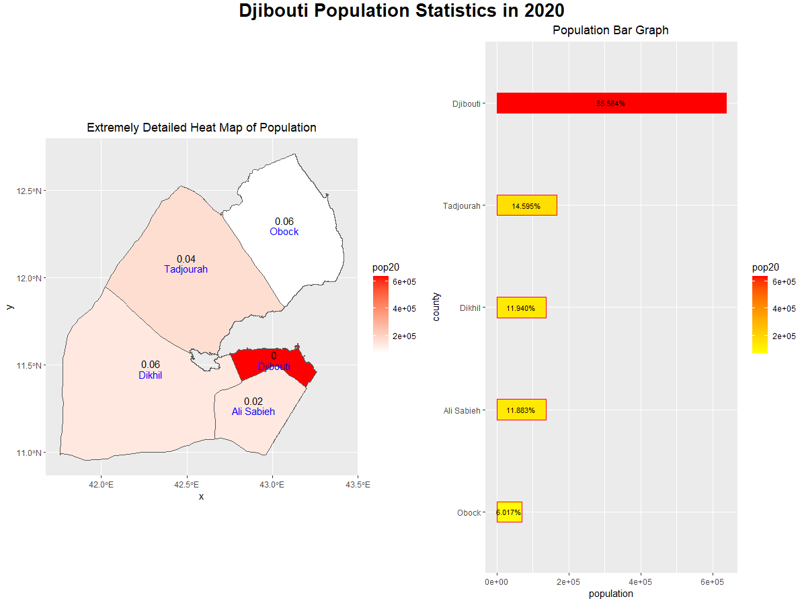

# Project 2

In this project, I made a heat map based on population in all of Djubouti's administrative districts (of which there are only 5, so this doesn't look too impressive).

   
   
Afterwards, I implemented a bar graph that arranges population by district and shows what percentage of Djibouti's population resides in each of its 5 districts.

