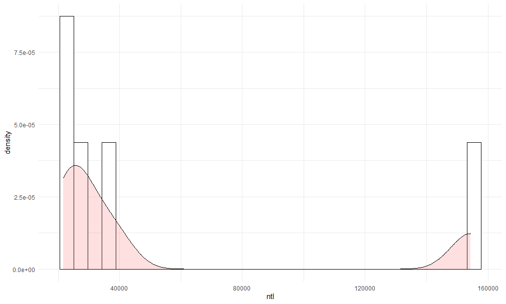

# Project 3

In this project, I made multiple grpahical representations of the population of the administrative districts of Djibouti.   
   
These were the two histograms.

   
   
Here are the regression lines, the small population (and variance across adms) made this really difficult to create; a larger, widespread population would have been ideal.

   

  

