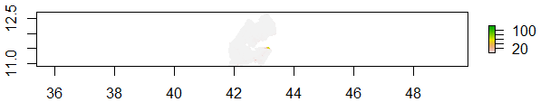

# Project 4

In this project, I made multiple 3-D representations of the population of the "adm2" districts of Djibouti.   
   

   
   

Spatial Plot Set 1:

   
   

Spatial Plot Set 2:

   
   

Spatial Plot Set 3:

   
   

Djibouti Population Map:

Out of these three spatial spots, all seemed to be very similar in both visual and numerical representation. I think it would make the most sense for the mean of covariates to yield the most accurate results. This assessment is by looking at the difference plot to see where any visible differences are combined with the fact that the mean representation should logically yield a more accurate representation.
