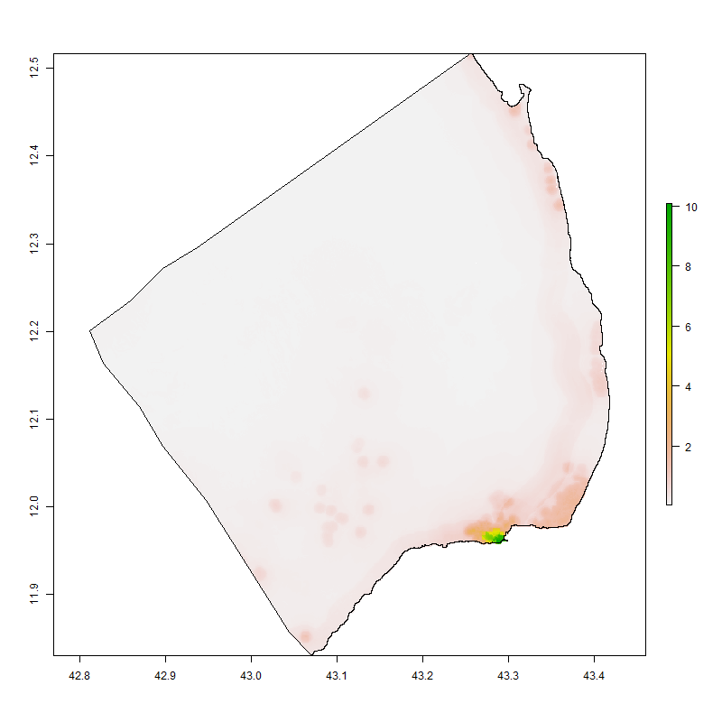
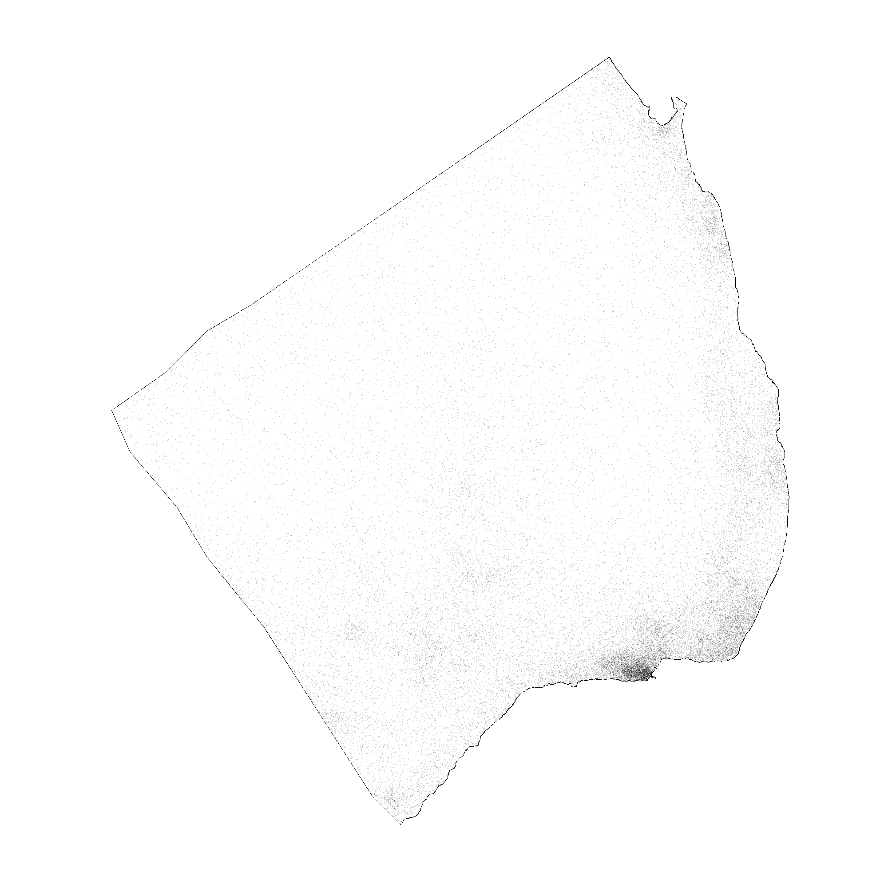
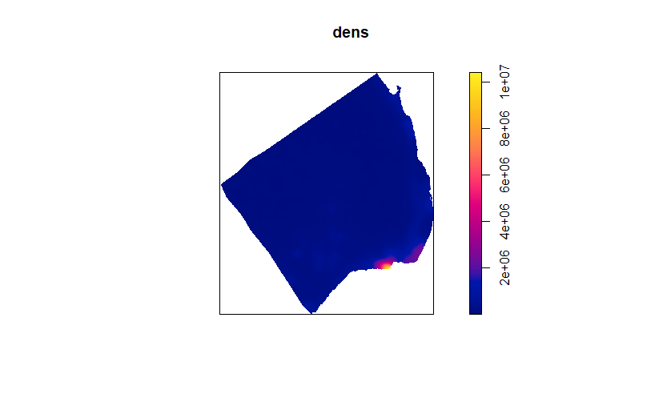
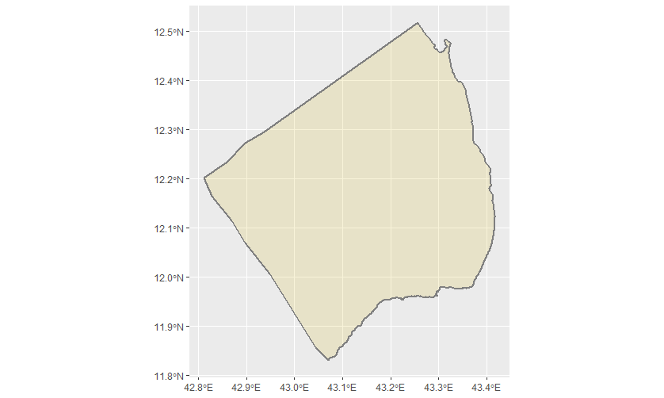

# Project 5

For this project, I first created a population count visualization using a color-coded heat map.

This is a different representation where populations are indicated with dots rather than a diffrent color.
   
   
Using the previous distribution, I was able to construct a map using the density function.

Here, I created the more simplistic version of my subdivision, Obock, using only one color. After trying multiple times (even using different countries altogether), I was not able to get my Dim object to have a proper list of x, y, and z coordinates. This errored out my Dcl and spatial lines data frame, which meant I couldn't get neat lines around areas of high population density. The best representation of density is therefore the third picture, with this fourth one mainly holding the structure of what would be the final product.
   
