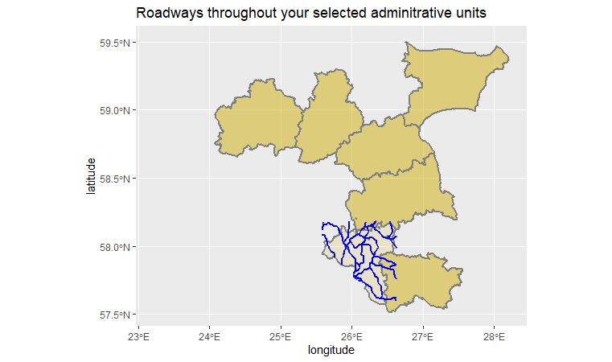
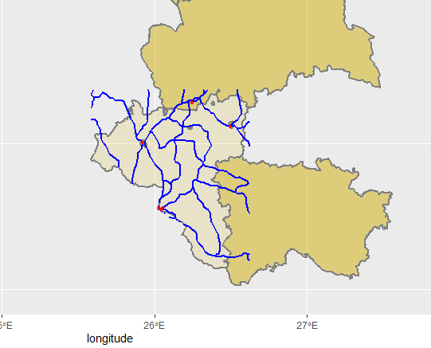
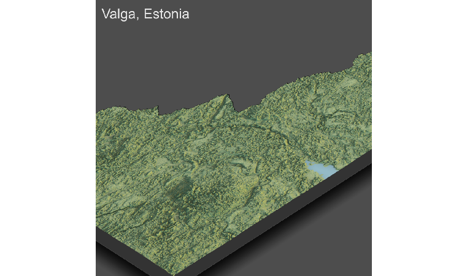
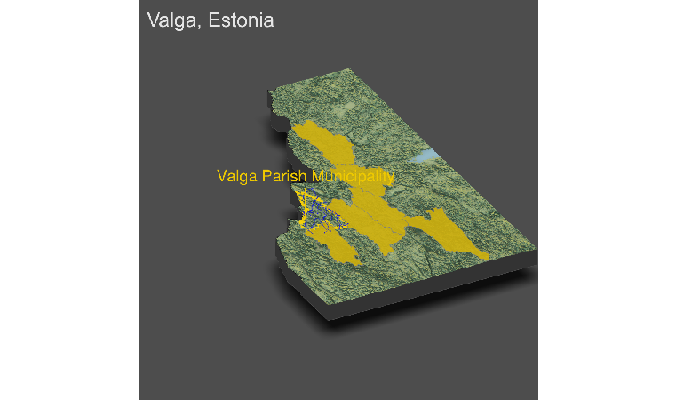

# Project 6 - Final Project

For this project, I created a 2-D visualization of the road system in a subdivision of Estonia. This data was located from a third-party site and so the conformations do not line up exactly, but you can generally see the shape.

Although there are very few health service providers in this part of Estonia, I outlined the few found in this urban area using red dots.
   
   
Here is a 3-D representation of this part of Estonia with the name.

Finally, I placed the older 2-D representation onto this one. I have also marked an area with high population density within the Valga subdivision. Since I got the data to create the models from another source, you can see that there are a bit of alignment issues with the final product, but it is still useful to generally see the breakdown of roads and medical services in this subdivision.

